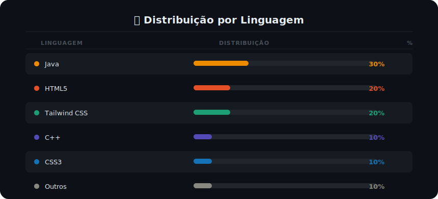
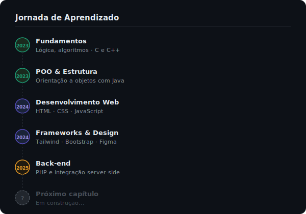
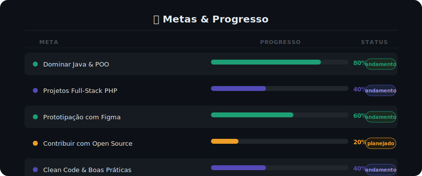

<div align="center">


<br/>

[](https://git.io/typing-svg)

<br/>

[](https://github.com/caio)
&nbsp;

&nbsp;


</div>

---

## 👤 Sobre mim

```java
public class Caio {

    String escola      = "CEFET";
    String curso       = "Tecnologia da Informação";
    String cidade      = "Brasil";
    String foco        = "Desenvolvimento de Software";

    String[] interesses = {
        "Desenvolvimento Web",
        "Programação de Sistemas",
        "UI/UX Design",
        "Open Source"
    };

    String[] objetivos = {
        "Evoluir como desenvolvedor full-stack",
        "Contribuir com projetos open source",
        "Dominar arquitetura de software"
    };

    String motivacao() {
        return "O código de hoje é o produto de amanhã.";
    }
}
```

---

## 🛠️ Stack Tecnológico

<div align="center">

### 💻 Linguagens de Programação


### 🌐 Front-end & Estilização


### 🎨 Design & Prototipação


### 🧰 Ferramentas & Ambiente


</div>

---

## 📊 Estatísticas GitHub

<div align="center">


<br/>


</div>

---

## 📈 Uso de Linguagens por Projeto

<div align="center">
  
</div>

---

## 🗺️ Jornada de Aprendizado



## 🎯 Metas & Progresso

<div align="center">


</div>

---

## 📅 Atividade Recente

<div align="center">

[](https://github.com/caio)

</div>

---

## 🤝 Conecte-se comigo

<div align="center">

[](https://linkedin.com/in/caio)
[](mailto:caio@email.com)
[](https://instagram.com/caio)
[](https://github.com/caio)

</div>

---

<div align="center">

### 💡 Frase que me motiva

> *"Todo especialista já foi um iniciante. Continue codando."*

<br/>


</div>
